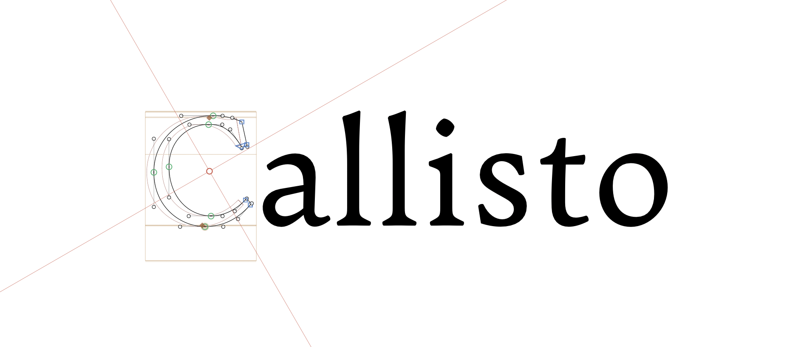

Callisto is an open-source serif typeface designed for easy readability over long stretches of small text in print and on-screen.
It was designed over the course of two or so years from 2022 to '24, going through a number of iterations before reaching its current state. The typeface follows in the footsteps of faces like Monotype's [Plantin](https://en.wikipedia.org/wiki/Plantin_(typeface)) and [the various Garamond typefaces](https://en.wikipedia.org/wiki/Garamond) in its wide apertures, chunky letterforms and pursuit of readability. It also incorporates some more modern elements, like the teardrop-less lowercase `a`, after Eric Gill's [Perpetua](https://en.wikipedia.org/wiki/Perpetua_(typeface)), and the flared stems on the ascenders of characters such as `l`, `h` and `k`.